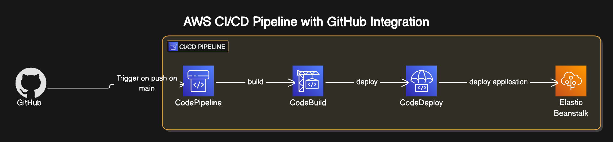

# 🚀 AWS CDK: CodePipeline to Elastic Beanstalk

This project defines an AWS infrastructure using the AWS CDK (TypeScript) to deploy applications to Elastic Beanstalk using a CI/CD pipeline powered by CodePipeline and CodeBuild.

---

## 🧱 Architecture Overview

The pipeline performs the following:

1. Pulls source code from a GitHub repository (or CodeCommit)
2. Builds the application using CodeBuild
3. Packages the application and uploads to S3
4. Deploys the application version to AWS Elastic Beanstalk

---

## 📊 Infrastructure Diagram

## 

## 🛠️ Useful Commands

- `npm run build` – Compile TypeScript to JavaScript
- `npm run watch` – Recompile on file changes
- `npm run test` – Run unit tests using Jest
- `npx cdk deploy` – Deploy the CDK stack to your AWS account
- `npx cdk diff` – Compare deployed stack with local state
- `npx cdk synth` – Synthesize and output the CloudFormation template

---
